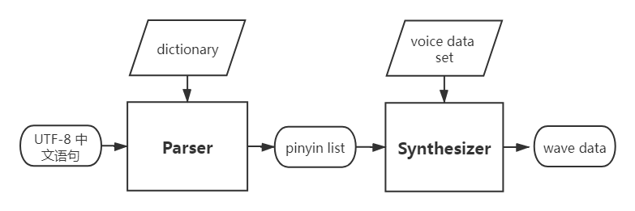

## ESP Chinese TTS [[中文]](./README.md)

Espressif Chinese TTS  is a lightweight TTS system designed for embedded systems。

## Overview

The Chinese TTS is based on concatenative  method. The flow diagram of system is as follows:



- **Parser** : a Chinese grapheme to phoneme module,  input text (UTF-8) and output Chinese pinyin list.
- **Synthesizer** : a concatenative synthesizer, input pinyin list and output wave raw data. The default encoding of raw data is mono, 16 bit@16000 Hz.

####  Features

- [x] UTF-8 encoding text input

- [x] Streaming output

- [x] Polyphonic pronunciation

- [x] Adjustable speech rate

- [ ] Custom sound set


## Performance Test

#### Resource Occupancy

Flash image size： 2.2 MB

RAM runtime: 20 KB

CPU loading test（ESP32 @ 240 MHz）:

| speech rate                 |  0   |  1   |  2   |  3   |  4   |  5   |
| --------------------------- | :--: | :--: | :--: | :--: | :--: | :--: |
| times faster than real time | 7.5  | 4.3  | 3.8  | 3.4  | 2.9  | 2.4  |

**Note:** the bigger rate, the faster speech speed. 0: slowest speaking speed, 5: fastest speaking speed.

#### Samples

- 欢迎使用乐鑫语音合成, &nbsp; &nbsp; [voice=小乐,speed=0](./samples/S1_xiaole_speed0.wav), &nbsp; &nbsp;  [voice=小乐,speed=4](./samples/S1_xiaole_speed4.wav)

- 支付宝收款 1111.11 元, &nbsp; &nbsp;  [voice=小乐,speed=0](./samples/S1_xiaole_speed0.wav), &nbsp; &nbsp;  [voice=小乐,speed=4](./samples/S2_xiaole_speed4.wav)

- 空调制热模式已打开，并调节到25度, &nbsp; &nbsp;  [voice=小乐,speed=0](./samples/S3_xiaole_speed0.wav), &nbsp; &nbsp;   [voice=小乐,speed=4](./samples/S3_xiaole_speed4.wav)

## User Guide

```c
#include "esp_tts.h"
#include "esp_tts_voice_female.h"

// 1. create esp tts handle by pre-define voice set 'esp_tts_voice_female'
esp_tts_handle_t *tts_handle=esp_tts_create(esp_tts_voice_female);

// 2. parse text and synthesis wave data
char *text="欢迎使用乐鑫语音合成";
if (esp_tts_parse_chinese(tts_handle, text)) {  // parse text into pinyin list
			int len[1]={0};
			do {
				short *data=esp_tts_stream_play(tts_handle, len, 4); // streaming synthesis
			    i2s_audio_play(data, len[0]*2, portMAX_DELAY);  // i2s output
			} while(len[0]>0);
			i2s_zero_dma_buffer(0);
}

```

please refer to [esp_tts.h](./include/esp_tts.h) for the details of API or examples in esp-skainet.


